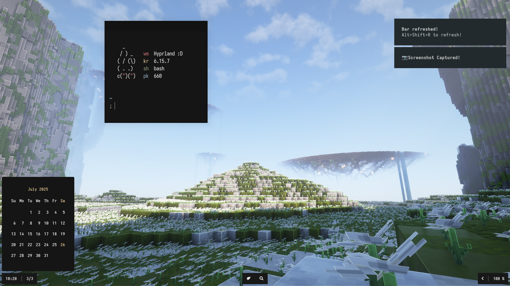

<h1 align="center"> Waybarian </h1>

<p align="center">
  <a href="https://github.com/ahmadinne/dots/stargazers"></a>
  <a href="https://github.com/ahmadinne/dots/issues"></a>
  <a href="https://github.com/ahmadinne/dots/network/members"></a>
  
</p>



> [!CAUTION]
> The Dots is still WIP, do not try to install, or it'll break!.

**Hello there, thanks for the visit!** \
This is my personal configuration files that forms the desktop you see above. \
<br/>
Shout out to these beast!:
+ <b>OS:</b> Archlinux
+ <b>WM:</b> Hyprland
+ <b>Widgets:</b> Waybar <3
+ <b>Notifs:</b> Mako
+ <b>Shell:</b> Bash
+ <b>Terminal:</b> Alacritty
+ <b>Editor:</b> Neovim
+ <b>File Manager:</b> Thunar and Yazi
+ <b>Launcher:</b> Rofi
+ <b>Browser:</b> Google-Chrome

<br/>

## Installation
> [!NOTE]
> The installation script only supports <b>Archlinux</b> and <b>Arch-based</b> distros.

> [!CAUTION]
> The installation script will <b>REPLACE ALL DUPLICATE FILES</b>, please backup your data first.

1. Clone the repo
    ```
    git clone https://github.com/ahmadinne/dots && cd dots
    ```

2. Run the Installation scripts
    ```
    ./install.sh
    ```

<br/>
<br/>

## Keybindings
These are the keybindings used in the dotfiles
| Key                                | Action                                  |
|------------------------------------|-----------------------------------------|
| ```Alt + A```                      | Open Applauncher (Rofi)                 |
| ```Alt + B```                      | Open Browser (Google-Chrome)            |
| ```Alt + T```                      | Open Terminal (Alacritty)               |
| ```Alt + E```                      | Open File Manager (Thunar)              |
| ```Alt + Q```                      | Close Focused Window                    |
| ```Alt + W```                      | Toggle Window Float/Tile                |
| ```Alt + F```                      | Toggle Fullscreen                       |
| ```Alt + Shift + F```              | Toggle Fake Fullscreen                  |
| ```Alt + [J/K]```                  | Switch Window Focus to left/right       |
| ```Alt + Shift + [J/K]```          | Move Windows to left/right              |
| ```Alt + [1-9]```                  | Switch Workspace Focus                  |
| ```Alt + Shift + [1-9]```          | Move Windows to another workspaces      |
| ```Alt + Mouse Left Hold```        | Move Floating Window                    |
| ```Alt + Mouse Right Hold```       | Resize Window                           |
| ```Alt + O```                      | Switch Output Audio (Speaker/Headphone) |
| ```Alt + ,```                      | Lower Speaker Volume                    |
| ```Alt + .```                      | Raise Speaker Volume                    |
| ```Alt + Shift + ,```              | Lower Screen Brightness                 |
| ```Alt + Shift + .```              | Raise Screen Brightness                 |
| ```Alt + P```                      | Screenshot entire screen                |
| ```Alt + Shift + P```              | Screenshot focused window               |
